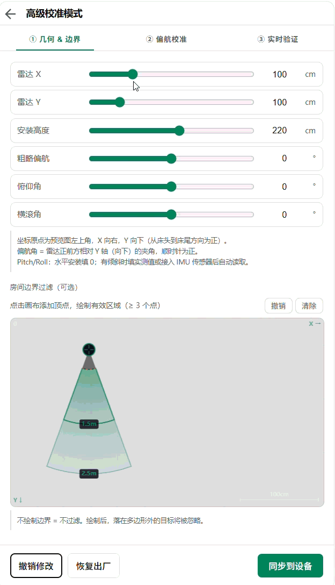

  
  <h1>MMWave Radar HA Card</h1>

[中文文档](./README_CN.md)

Multi-model millimeter-wave radar calibration & live visualization card for [Home Assistant](https://www.home-assistant.io/).

## What is this?

This Lovelace card provides a real-time, top-down map of your room, visualizing the exact location of targets detected by your mmWave radars. It includes built-in tools to easily calibrate your radar's orientation and define room boundaries, making smart home presence detection more accurate and intuitive than ever.

## Screenshots

_(Tab ① — Geometry & Boundary | Tab ② — Yaw Calibration | Tab ③ — Live View)_

## Quick Start (Out-of-the-Box)

### 1. Install via HACS (Recommended)

Alternatively: **HACS → Frontend → ⋮ → Custom repositories** → add this repo URL → category **Lovelace**.

### 2. Add to Dashboard

You can configure the card entirely through the Home Assistant UI! Just add a new card to your dashboard and search for **"MMWave Radar Card"**. The visual config editor includes a model-aware entity picker to help you set it up in seconds—**no YAML required**!

## Advanced Usage (DIY)

For advanced users who prefer YAML configuration, need to understand the underlying calibration parameters, or developers who want to add support for new radar models or build the card from source, please refer to our DIY documentation:

👉 **[Advanced Configuration & DIY Guide](./DIY.md)**

## Supported Models

| Model                                        | Freq   | Targets | Z axis | Breathing | Heart rate | Sleep |
| -------------------------------------------- | ------ | ------- | ------ | --------- | ---------- | ----- |
| [MicRadar R60ABD1](https://www.micradar.cn/) | 60 GHz | 1       | ✅     | ✅        | ✅         | ✅    |
| [Hi-Link LD2450](https://www.hlktech.net/)   | 24 GHz | 3       | ❌     | ❌        | ❌         | ❌    |

Adding a new model requires only creating one file — see [Adding a New Model](#adding-a-new-model).

---

## License

MIT © zomco
